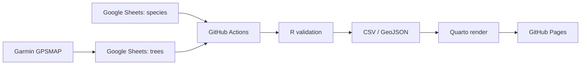

## 概要

このサイトは、Google Sheetsを入力用のマスター、Rをデータ検証・変換、Quartoを静的サイト生成、LeafletをWeb地図表示、GitHub ActionsとGitHub Pagesを公開基盤として使います。

サーバー常駐型のShinyアプリではなく、HTML、CSS、JavaScript、CSV、GeoJSONだけで動く静的サイトです。公開後の閲覧にはGitHub Pages以外のサーバーを必要としません。

## データフロー

`trees` シートは1行1個体の樹木データ、`species` シートは樹種ごとの補助情報です。GitHub ActionsがSheets由来のCSVを読み込み、公開対象行だけをCSVとGeoJSONへ変換します。

## 検証ルール

Rスクリプトは公開前に以下を確認します。

- 必須列がそろっていること。
- `publish == TRUE` の行に `tree_id`, `species_jp`, `lat`, `lon` があること。
- 公開行の `tree_id` が重複していないこと。
- 緯度・経度がWGS84の有効範囲内にあること。
- `survey_date` が `YYYY-MM-DD` であること。
- `marker_color` が `#RRGGBB` 形式であること。
- キャンパス境界を設定した場合、公開座標がその範囲内にあること。

## 公開サイト

地図画面は `data/public/trees.geojson` を読み込み、Leafletで点を描画します。点にマウスを重ねると樹種、学名、調査日、精度、公開メモを表示します。スマートフォンなどホバーがない環境では、点または一覧のIDをタップして情報を確認します。

一覧、検索、樹種フィルター、CSV/GeoJSONダウンロードはすべてブラウザ上のJavaScriptで動きます。

## GitHub Actions

`.github/workflows/publish.yml` は以下の順で実行します。

1. QuartoとRをセットアップする。
2. `tests/test-validation.R` で検証ロジックをテストする。
3. `scripts/build_data.R` で公開CSV/GeoJSONを生成する。
4. `scripts/check_generated_outputs.R` で生成物を確認する。
5. `quarto render` で `_site` を生成する。
6. GitHub Pagesへデプロイする。

workflowは `main` へのpush、手動実行、定期実行で動きます。

## 主なファイル

| ファイル | 役割 |
| --- | --- |
| `index.qmd` | 公開地図ページ |
| `tech-stack.qmd` | 技術詳細ページ |
| `assets/map.js` | Leaflet地図、検索、フィルター、一覧表示 |
| `assets/styles.css` | サイトと地図UIのスタイル |
| `scripts/build_data.R` | Sheets/CSVから公開CSVとGeoJSONを生成 |
| `scripts/tree_data_lib.R` | データ読み込み、検証、GeoJSON出力の共通関数 |
| `tests/test-validation.R` | 代表的な検証ケースのテスト |
| `.github/workflows/publish.yml` | GitHub Pagesへの自動公開 |

## 運用上の考え方

Google Sheetsを唯一の入力場所にし、GitHub上の `data/public/trees.csv` と `data/public/trees.geojson` は再生成可能な公開成果物として扱います。この分け方により、現地調査後の入力は簡単に保ちつつ、公開前の検証と履歴管理はGitHub側で維持できます。
